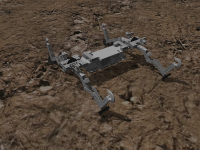
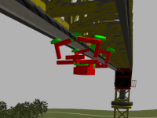
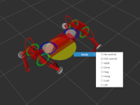
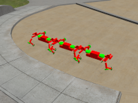

# OpenVMP

[Join our Discord server!](https://discord.gg/zdEzrHQY)

**Open Versatile Mobility Platform** (**OpenVMP**)
is a community project with the goal of making it possible for anyone
to build multi-modal mobility robots
using affordable off-the-shelf parts and open source software.
This repository contains all the necessary software, bills of materials
and assembly instructions.

The aim is to develop heavy-duty robots that can be controlled remotely.
The platform allows anyone, anywhere in the world, to learn how to
operate these robots, possibly through simulation environments. Once
trained, users can easily operate robots belonging to others, without
being limited by manufacturer restrictions or targeted audiences. This
approach facilitates the rapid development and deployment of robotics
without being impeded by profit or other motives.

These robots can complete tasks either independently or collaboratively.
This means that a group of robots can work together in two ways:
figuratively (each robot follows its own path to explore more territory)
or literally (robots physically connect to form a larger robot).

This is the monorepo of the OpenVMP project.
Some of the internal components are git submodules
that are also designed to be equally usable as standalone ROS2 packages
outside of OpenVMP. But other packages (where the name starts with `openvmp_`) are made exclusively for OpenVMP.

## Key features

### Multi-Modal Mobility

OpenVMP robots supports various modes of transportation, including:

- Wheeled driving on or off-road
- Quadrupedal walking or crawling
- Climbing cylindrical objects such as trees, poles, pipes, ropes and cables
- Climbing and driving inside pipes, ducts or tunnels
- Climbing warehouse shelving units

### Individual Performance

OpenVMP robots are capable of performing basic mechanical tasks with their
limbs, but their full potential is unlocked through the use of extension
modules (see 'Modularity' section below). These robots can operate independently
for extended periods of time while minimizing power usage when idle. One key
application is sending individual OpenVMP units to perform ad-hoc tasks like
reconnaissance, communication, supply, and delivery, while temporarily
separating from the collective.

### Collective Performance

OpenVMP units can improve their mobility by mechanically joining together
and sharing resources for computation and communication. This versatility
is evident in scenarios such as climbing artificial structures (e.g.,
buildings, industrial complexes, pipes, poles, fences, and barricades)
and overcoming natural barriers (e.g., trees, ravines, and small cliffs).

### Modularity

Each OpenVMP unit may have one or more payload modules, typically including:

OpenVMP units can be equipped with one or more payload modules,
which typically include interchangeable front and rear modules.
These modules enable the units to perform functional tasks using
multipurpose or specialized tools, such as mechanical tools,
inspection devices, liquid dispensers, or defense mechanisms.
They are designed to be hot-swappable for easy replacement
during missions.

In addition to the front and rear modules, OpenVMP units can also feature
a top module. This module may contain advanced computing units,
large robotic arms, extra power supplies, or other components
that may significantly enhance capabilities of an entire swarm of robots.
Unlike the front and rear modules, the top module is hardwired and
cannot be hot-swapped.

## What's included

This repository contains the software needed to simulate OpenVMP units,
including simulation worlds designed to showcase some of their
capabilities. Additionally, it includes some software required for
operating real OpenVMP units. The remaining software and hardware
blueprints for various OpenVMP unit types currently under development
will be published here soon.

All materials in the OpenVMP repositories are available under the Apache
2.0 open-source license. To minimize the risk of patent trolls claiming
minor improvements on OpenVMP's work, just in case, contributors have
documented the features and ideas they've considered and planned in
[the claims](docs/Claims.md).

## More information

See the following documents for more info:

- [How to build OpenVMP software](docs/Development.md)
- [How to run a simulation](docs/Simulation.md)
- [How to build a real OpenVMP robot](docs/Hardware.md)
- [How to deploy to a real robot](docs/Deployment.md)
- [Included ROS2 packages](docs/ROS2_packages.md)
- [Roadmap](docs/Roadmap.md)
- [License](docs/License.md)
