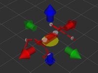
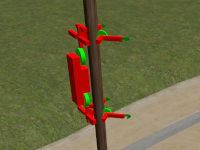
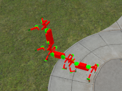

# OpenVMP

Version: Alpha 1

**Open Versatile Mobility Platform** (**OpenVMP**)
implements multi-modal mobility mechanisms
that perform arbitrary tasks individually or collectively.

This is the monorepo of the OpenVMP project.
Some of the internal components are git submodules
that are also designed to be equally usable as standalone ROS2 packages
outside of OpenVMP
(unless the name of the package starts with `openvmp_`).

## Key features

### Multi-modal mobility

OpenVMP provides support for robots that can use different modes of transportation:

- driving on or off road using wheels
- crawling on multiple points of contact
- walking straight on two, three or four legs
- climbing trees, poles, pipes, ropes, cables and other near-cylindrical objects
- climbing and driving inside pipes and tunnels
- climbing warehouse shelving units

### Individual performance

Besides performing various movement and transportation mentioned above, OpenVMP can use the same limbs to perform various mechanical tasks:

- digging & lifting objects
- hauling & moving objects
- opening & closing doors & windows

Single OpenVMP units can perform these tasks by themselves over an extended
period of time.
OpenVMP software provides support for keeping power usage at a minimum while idle.

However the most important use case for individual performance is individual
OpenVMP units leaving the collective temporarily to perform an ad-hoc task
(recon, comms, supply, delivery etc).

### Collective performance

Multiple OpenVMP units can not only share their resources to achieve computation
and communication goals, but also join their bodies mechanically to achieve
a better mobility performance. The collective performance for units
with versatile mobility capabilities can be best seen in the following cases:

- climbing artificial structures
  - buildings or industrial complexes
  - pipes and tubes of complex geometries
  - poles of all kinds
  - fences and barricades
- passing natural barriers
  - trees
  - ravines
  - small cliffs

### Modularity

Each OpenVMP unit may have one or more payload modules.

Most OpenVMP units are expected to carry 3 payloads:

- front and rear (interchangeable) modules
  - each robot is expected to carry them
  - enables the robot to perform functional tasks
    - multipurpose or specialized mechanical tools
    - optical, electromagnetic (including wireless comms) and ultrasonic inspection tools
    - liquid/paint dispensers
    - defense mechanisms
    - etc
  - can be connected/disconnected by the robot itself (hot swappable)
- one top module
  - most likely, not more than one module of each kind per swarm
  - preferably, enhances capabilities of the entire swarm
    - advanced computing units
    - large robotic arms
    - extra power supplies
    - etc
  - hardwired permanently (not hot swappable)

## What's included

This repository contains all the software required to simulate OpenVMP units with a number of simulation worlds created specifically to demonstrate certain (but not yet all!) capabilities.

This repository also includes some of the software required to operate real OpenVMP units. The rest of the software (as well as the hardware blueprints for a number of different types of OpenVMP units that are currently being built) will also be published here soon. Stay tuned!

All materials in all OpenVMP repositories are published using the Apache 2.0 open-source license. To prevent patent trolls from making claims for minor improvements on top of the information published by OpenVMP, [the claims](docs/Claims.md) are made about the features and inventions that have already been considered and planned by OpenVMP contributors.

## More information

See the following documents for more info:

- [How to build OpenVMP software](docs/Development.md)
- [How to run a simulation](docs/Simulation.md)
- [How to build a real OpenVMP robot](docs/Hardware.md)
- [How to deploy to a real robot](docs/Deployment.md)
- [Included ROS2 packages](docs/ROS2_packages.md)
- [Roadmap](docs/Roadmap.md)
- [License](docs/License.md)
